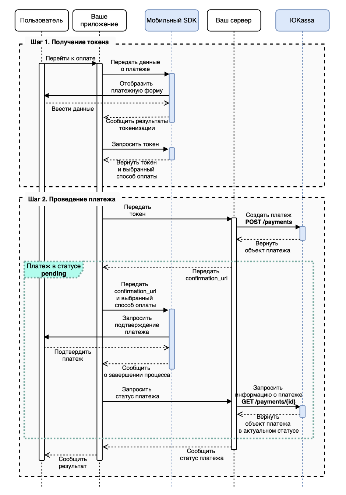
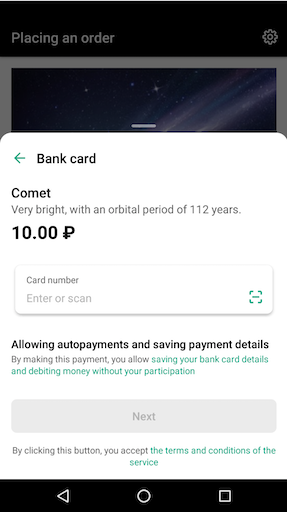
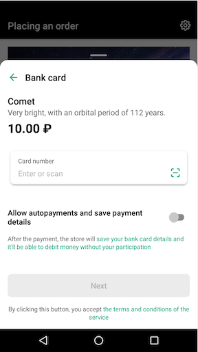
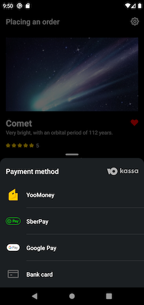
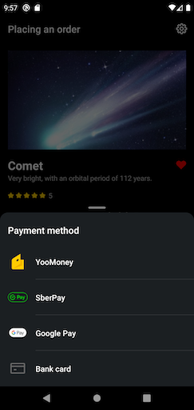
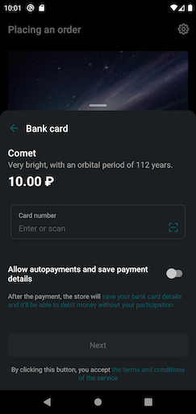
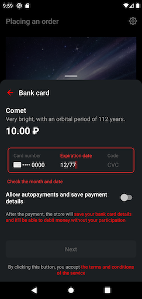
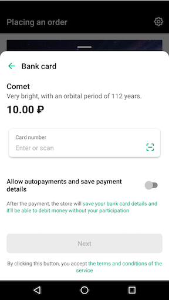

# <a name="yookassa-payments-sdk"></a> YooKassa Payments SDK

[](https://img.shields.io/badge/Support-SDK%2021+-brightgreen.svg)
[](https://img.shields.io/maven-central/v/ru.yoomoney.sdk.kassa.payments/yookassa-android-sdk)
[](https://opensource.org/licenses/MIT)

Данное SDK позволяет проводить платежи с использованием платёжного токена.

Общий процесс оплаты в мобильном приложении выглядит следующим образом:
1. Вы запускаете процесс [токенизации в SDK](#токенизация);
    - пользователю отображается список возможных методов оплаты;
    - пользователь выбирает способ оплаты, вводит необходимые данные;
    - если данные введены верно и процесс токензизации завершился успешно, то SDK обменивает данные, которые ввел пользователь, на платежный токен `payment_token` и возвращает в ваше приложение этот `payment_token` ([Получить результат токенизации](#получить-результат-токенизации)).
2. Из данного платежного токена необходимо создать платеж с помощью [метода API](https://yookassa.ru/developers/api#create_payment). Таким образом, **SDK работает как дополнение к [API ЮKassa](https://yookassa.ru/developers/payments/sdk-tokens)**
3. При необходимости запускаете в SDK процесс [подтверждения платежа](#подтверждение-платежа) с помощью 3DS или SberPay.

**Диаграмма процесса токенизации и проведения платежа:**



В SDK входят готовые платежные интерфейсы (форма оплаты и всё, что с ней связано).

С помощью SDK можно получать токены для проведения оплаты с банковской карты, Сбербанка или из кошелька в ЮMoney.

В этом репозитории лежит код SDK и пример приложения, которое его интегрирует.
* [Код библиотеки](./library)
* [Код демо-приложения, которое интегрирует SDK](./sample)


# <a name="документация"></a> Документация

Android Checkout mobile SDK - версия $versionName ([changelog](./CHANGELOG.md))

* [Changelog](#changelog)
* [Migration guide](#migration-guide)
* [Подключение через Gradle](#подключение)
* [Рекомендации по интеграции](#рекомендации-по-интеграции)
    * [Настройка приложения при продаже цифровых товаров](#настройка-приложения-при-продаже-цифровых-товаров)
    * [Рекомендуемые совместимые версии](#рекомендуемые-совместимые-версии)
* [Использование библиотеки](#использование-библиотеки)
    * [Токенизация](#токенизация)
        * [Запуск токенизации всеми методами](#запуск-токенизации-всеми-методами)
        * [Запуск токенизации кошельком ЮMoney](#запуск-токенизации-кошельком-юмани)
        * [Запуск токенизации SberPay](#запуск-токенизации-сберпей)
        * [Запуск токенизации СБП](#запуск-токенизации-сбп)
        * [Запуск токенизации банковской картой](#запуск-токенизации-банковской-картой)
        * [Запуск токенизации для сохранённых банковских карт](#запуск-токенизации-для-сохранённых-банковских-карт)
        * [Получить результат токенизации](#получить-результат-токенизации)
    * [Подтверждение платежа](#подтверждение-платежа)
        * [SberPay](#sberpay)
        * [3DSecure](#3dsecure)
        * [СБП](#сбп)
    * [Привязанная карта](#привязанная-карта)
    * [Рекуррентные платежи](#рекуррентные-платежи)
    * [Настройка логирования и mock режима](#настройка-логирования-и-mock-режима)
    * [Настройка интерфейса](#настройка-интерфейса)
        * [Включение логирования](#включение-логирования)
        * [Настройка mock режима](#настройка-тестового-режима)
    * [Сканирование банковской карты](#сканирование-банковской-карты)
* [Модерация приложения (используемые зависимости)](#вопрос-модерации)
  * [Разрешения доступа к геолокации](#использование-разрешений-для-доступа-к-местоположению)
* [Полезные ссылки](#полезные-ссылки)

# <a name="changelog"></a> Changelog

[Ссылка на Changelog](./CHANGELOG.md)

# <a name="migration-guide"></a> Migration guide

[Ссылка на Migration guide](./MIGRATION.md)

# <a name="подключение"></a> Подключение через Gradle

Для подключения библиотеки пропишите зависимости в build.gradle модуля:

```groovy
repositories {
    mavenCentral()
}

dependencies {
    implementation 'ru.yoomoney.sdk.kassa.payments:yookassa-android-sdk:6.5.0'
}
```

Также необходимо подключить kotlin plugin. Для этого нужно добавить в файл build.gradle root каталога следующий блок кода:

```groovy
buildscript {
    dependencies {
        classpath "org.jetbrains.kotlin:kotlin-gradle-plugin:1.5.31"
    }
}
```

В app модуль добавить в файл build.gradle:

```groovy
plugin {
    id 'kotlin-android'
}

```

В AndroidManifest'е вашего приложения внутри тэга application необходимо добавить настройки доступа к сети для корректной работы библиотеки. 
Возможны два случая:

1) Вы указываете атрибут networkSecurityConfig впервые для вашего приложения. Вам необходимо сослаться на файл конфигурации
   из библиотеки в вашем AndroidManifest файле внутри тэга application следующим образом:
```
android:networkSecurityConfig="@xml/ym_network_security_config"
```

2) У вас уже указан атрибут networkSecurityConfig в AndroidManifest.
Необходимо добавить в этот указанный файл следующую запись:
```xml
<domain-config cleartextTrafficPermitted="true">
        <domain includeSubdomains="true">certs.yoomoney.ru</domain>
</domain-config>
```
# <a name="рекомендации-по-интеграции"></a> Рекомендации по интеграции

## <a name="настройка-приложения-при-продаже-цифровых-товаров"></a> Настройка приложения при продаже цифровых товаров

Если в вашем приложении продаются цифровые товары, нужно отключить Google Pay из списка платежных опций.
Для этого добавьте в AndroidManifest следующий код:

```xml
<meta-data
    android:name="com.google.android.gms.wallet.api.enabled"
    tools:node="remove" />
```


## <a name="рекомендуемые-совместимые-версии"></a> Рекомендуемые совместимые версии

Минимально поддерживаемая версия Android SDK: 21 (Android 5.0).

Для корректной работы библиотеки следует использовать в приложении:
- Kotlin версии 1.7.10;
- targetSdkVersion 33;
- Версия Gradle 7.0.+.

# <a name="использование-библиотеки"></a> Использование библиотеки

## <a name="токенизация"></a> Токенизация

Процесс токенизации — это обмен платёжных данных, на платёжный токен `payment_token`. Далее этот токен, используется для создания платежа [методом API](https://yookassa.ru/developers/api#create_payment)

Для запуска процесса токенизации используется метод `Checkout.createTokenizeIntent()`. Метод отдаёт `Intent`, который нужно запустить в `startActivityForResult()`. После этого управление процессом перейдёт в SDK.
Готовый платёжный токен можно получить в `onActivityResult()`

Обязательные параметры метода:
- context (Context) - контекст приложения;
- paymentParameters (PaymentParameters) - параметры платежа.

Опциональные параметры метода:
- testParameters (TestParameters) - параметры для тестового режима - включить логирование/использовать mock-данные (см. [Настройка логирования и mock режима](#настройка-логирования-и-mock-режима));
- uiParameters (UiParameters) - настройка интерфейса (см. [Настройка интерфейса](#настройка-интерфейса))

Поля `PaymentParameters`:

Обязательные:
- amount (Amount) - стоимость товара. Допустимые способы оплаты могут меняться в зависимости от этого параметра. Этот параметр отобразится на экране выбранного способа оплаты при токенизации выбранным способом оплаты;
- title (String) - название товара. Этот параметр отобразится на экране выбранного способа оплаты при токенизации выбранным способом оплаты;
- subtitle (String) - описание товара. Этот параметр отобразится на экране выбранного способа оплаты при токенизации выбранным способом оплаты;
- clientApplicationKey (String) - ключ для клиентских приложений из личного кабинета ЮKassa ([раздел Настройки — Ключи API](https://yookassa.ru/my/api-keys-settings));
- shopId (String) - идентификатор магазина в ЮKassa ([раздел Организации](https://yookassa.ru/my/company/organization) - скопировать shopId у нужного магазина);
- savePaymentMethod (SavePaymentMethod) - настройка сохранения платёжного метода. Сохранённые платёжные методы можно использовать для проведения рекуррентных платежей, (см. [Рекуррентные платежи](#рекуррентные-платежи)).

Необязательные:
- paymentMethodTypes (Set of PaymentMethodType) - ограничения способов оплаты. Если оставить поле пустым или передать в него null, библиотека будет использовать все доступные способы оплаты, (см. [Запуск токенизации всеми методами](#запуск-токенизации-всеми-методами));
- customReturnUrl (String) - url страницы (поддерживается только https), на которую надо вернуться после прохождения 3ds. **Должен использоваться только при при использовании своего Activity для 3ds url**, (см. [3DSecure](#3dsecure)), или при необходимости продолжить работу внутри WebView;
- userPhoneNumber (String) - номер телефона пользователя при оплате через SberPay, (см. [Запуск токенизации SberPay](#запуск-токенизации-сберпей));
- authCenterClientId (String) - уникальный идентификатор приложения для токенизации через ЮMoney. (см. [Запуск токенизации кошельком ЮMoney](#запуск-токенизации-кошельком-юмани))

Поля класса `Amount`:
- value (BigDecimal) - сумма;
- currency (Currency) - валюта.

Значения `SavePaymentMethod`:
- ON - Сохранить платёжный метод для проведения рекуррентных платежей. Пользователю будут доступны только способы оплаты, поддерживающие сохранение. При первой оплате на экране выбранного способа оплаты будет отображено сообщение о том, что платёжный метод будет сохранён.
- OFF - Не сохранять платёжный метод.
- USER_SELECTS - Пользователь выбирает, сохранять платёжный метод или нет. Если метод можно сохранить, на экране экране выбранного способа оплаты появится переключатель.
  Подробнее про рекуррентные платежи можно прочитать в разделе [Рекуррентные платежи](#рекуррентные-платежи).

Значения `PaymentMethodType`:
- YOO_MONEY - оплата произведена с кошелька ЮMoney;
- BANK_CARD - оплата произведена с банковской карты;
- SBERBANK - оплата произведена через Сбербанк (SMS invoicing или SberPay);
- SBP - оплата произведена через CБП (Система Быстрых Платежей).

### <a name="запуск-токенизации-всеми-методами"></a> Запуск токенизации всеми методами

Для того, чтобы запустить токенизацию всеми доступными методами оплаты, необходимо вызвать метод `createTokenizeIntent` и передать в него объект `PaymentParameters`, в котором находится набор всех спобосов оплаты или же не передавать этот набор.

**Вариант 1**:

<details open>
  <summary>Kotlin</summary>

```kotlin
class MyActivity : AppCompatActivity() {

    fun startTokenize() {
        val paymentParameters = PaymentParameters(
            amount = Amount(BigDecimal.TEN, Currency.getInstance("RUB")),
            title = "Название товара",
            subtitle = "Описание товара",
            clientApplicationKey = "live_thisKeyIsNotReal", // ключ для клиентских приложений из личного кабинета ЮKassa 
            shopId = "12345", // идентификатор магазина ЮKassa
            savePaymentMethod = SavePaymentMethod.OFF, // флаг выключенного сохранения платежного метода,
            paymentMethodTypes = setOf(PaymentMethodType.YOO_MONEY, PaymentMethodType.BANK_CARD, PaymentMethodType.SBERBANK, PaymentMethodType.GOOGLE_PAY), // передан весь список доступных методов оплаты
            customReturnUrl = "https://custom.redirect.url", // url страницы (поддерживается только https), на которую надо вернуться после прохождения 3ds. 
            userPhoneNumber = "+79041234567", // номер телефона пользователя для автозаполнения поля номера телефона пользователя в SberPay. Поддерживаемый формат данных: "+7XXXXXXXXXX"
            authCenterClientId = "example_authCenterClientId" // идентификатор, полученный при регистрации приложения на сайте https://yookassa.ru
        )
        val intent = createTokenizeIntent(this, paymentParameters)
        startActivityForResult(intent, REQUEST_CODE_TOKENIZE)
    }
}
```
</details>

<details>
  <summary>Java</summary>

```java
class MyActivity extends AppCompatActivity {

    void startTokenize() {
        Set<PaymentMethodType> paymentMethodTypes = new HashSet<PaymentMethodType>(){{
            add(PaymentMethodType.SBERBANK); // выбранный способ оплаты - SberPay
            add(PaymentMethodType.YOO_MONEY); // выбранный способ оплаты - ЮMoney
            add(PaymentMethodType.BANK_CARD); // выбранный способ оплаты - Банковская карта
            add(PaymentMethodType.SBP); // выбранный способ оплаты - СБП
        }};
        PaymentParameters paymentParameters = new PaymentParameters(
                new Amount(BigDecimal.TEN, Currency.getInstance("RUB")),
                "Название товара",
                "Описание товара",
                "live_thisKeyIsNotReal", // ключ для клиентских приложений из личного кабинета ЮKassa 
                "12345", // идентификатор магазина ЮKassa
                SavePaymentMethod.OFF, // флаг выключенного сохранения платежного метода
                paymentMethodTypes, // передан весь список доступных методов оплаты
                "gatewayId", // gatewayId магазина для платежей Google Pay (необходим в случае, если в способах оплаты есть Google Pay)
                "https://custom.redirect.url", // url страницы (поддерживается только https), на которую надо вернуться после прохождения 3ds. Должен использоваться только при при использовании своего Activity для 3ds url (вы не используете метод createConfirmationIntent() из SDK) или при необходимости продолжить работу внутри WebView;. 
                userPhoneNumber = "+79041234567", // номер телефона пользователя. Используется для автозаполнения поля при оплате через SberPay. Поддерживаемый формат данных: "+7XXXXXXXXXX".
                null, // настройки для токенизации через GooglePay,
                "example_authCenterClientId" // идентификатор, полученный при регистрации приложения на сайте https://yookassa.ru
        );
        Intent intent = Checkout.createTokenizeIntent(this, paymentParameters);
        startActivityForResult(intent, REQUEST_CODE_TOKENIZE);
    }
}
```
</details>

**Вариант 2**:

<details open>
  <summary>Kotlin</summary>

```kotlin
class MyActivity : AppCompatActivity() {

    fun startTokenize() {
        val paymentParameters = PaymentParameters(
            amount = Amount(BigDecimal.TEN, Currency.getInstance("RUB")),
            title = "Название товара",
            subtitle = "Описание товара",
            clientApplicationKey = "live_thisKeyIsNotReal", // ключ для клиентских приложений из личного кабинета ЮKassa (https://yookassa.ru/my/api-keys-settings)
            shopId = "12345", // идентификатор магазина ЮKassa
            savePaymentMethod = SavePaymentMethod.OFF, // флаг выключенного сохранения платежного метода,
            authCenterClientId = "example_authCenterClientId", // идентификатор, полученный при регистрации приложения на сайте https://yookassa.ru
            gatewayId = "gatewayId", // gatewayId магазина для платежей Google Pay (необходим в случае, если в способах оплаты есть Google Pay)
            customReturnUrl = "https://custom.redirect.url", // url страницы (поддерживается только https), на которую надо вернуться после прохождения 3ds. Должен использоваться только при при использовании своего Activity для 3ds url (вы не используете метод createConfirmationIntent() из SDK) или при необходимости продолжить работу внутри WebView;. 
            userPhoneNumber = "+79041234567", // номер телефона пользователя. Используется для автозаполнения поля при оплате через SberPay. Поддерживаемый формат данных: "+7XXXXXXXXXX".
        )
        val intent = Checkout.createTokenizeIntent(this, paymentParameters)
        startActivityForResult(intent, REQUEST_CODE_TOKENIZE)
    }
}
```
</details>

<details>
  <summary>Java</summary>

```java
class MyActivity extends AppCompatActivity {

    void startTokenize() {
        PaymentParameters paymentParameters = new PaymentParameters(
                new Amount(BigDecimal.TEN, Currency.getInstance("RUB")),
                "Название товара",
                "Описание товара",
                "live_thisKeyIsNotReal", // ключ для клиентских приложений из личного кабинета ЮKassa 
                "12345", // идентификатор магазина ЮKassa
                SavePaymentMethod.OFF, // флаг выключенного сохранения платежного метода
                null, // передан весь список доступных методов оплаты
                "gatewayId", // gatewayId магазина для платежей Google Pay (необходим в случае, если в способах оплаты есть Google Pay)
                "https://custom.redirect.url", // url страницы (поддерживается только https), на которую надо вернуться после прохождения 3ds. Должен использоваться только при при использовании своего Activity для 3ds url (вы не используете метод createConfirmationIntent() из SDK) или при необходимости продолжить работу внутри WebView;. 
                "+79041234567", // номер телефона пользователя. Используется для автозаполнения поля при оплате через SberPay. Поддерживаемый формат данных: "+7XXXXXXXXXX".
                null, // настройки для токенизации через GooglePay,
                "example_authCenterClientId" // идентификатор, полученный при регистрации приложения на сайте https://yookassa.ru
        );
        Intent intent = Checkout.createTokenizeIntent(this, paymentParameters);
        startActivityForResult(intent, REQUEST_CODE_TOKENIZE);
    }
}
```
</details>

**Обработка результата процесса токенизации находится в разделе** [Получить результат токенизации](#получить-результат-токенизации)


### <a name="запуск-токенизации-кошельком-юmoney"></a> Запуск токенизации кошельком ЮMoney

> Если среди платёжных методов есть кошелёк ЮMoney, необходимо зарегистрировать приложение и получить `authCenterClientId`.
В остальных случаях этот шаг можно пропустить.

Если вы ранее уже регистрировали приложение для **oAuth-авторизации**, то список ваших приложений можно найти на странице https://yookassa.ru/oauth/v2/client
Если вы ещё не регистрировали приложение для **oAuth-авторизации**, то нужно выполнить следующие инструкции.
1. Для регистрации нового приложения необходимо авторизоваться на сайте https://yookassa.ru
2. После авторизации перейдите на страницу регистрации приложения – https://yookassa.ru/oauth/v2/client
3. Нажмите на кнопку создать приложение и задайте значение параметрам:
    * Название;
    * Описание. По желанию;
    * Ссылка на сайт;
    * Сallback URL – любой, можно указать ссылку на сайт;
    * Доступы. Тут есть три раздела `API ЮKassa`, `Кошелёк ЮMoney`, `Профиль ЮMoney`.
        * В разделе `Кошелёк ЮMoney` выдайте разрешение на чтение баланса кошелька пользователя. Для этого в разделе **БАЛАНС КОШЕЛЬКА** поставьте галку на против поля **Просмотр**;
        * Откройте раздел `Профиль ЮMoney` и выдайте разрешение на чтение телефона, почты, имени и аватара пользователя. Для этого в разделе **ТЕЛЕФОН, ПОЧТА, ИМЯ И АВАТАР ПОЛЬЗОВАТЕЛЯ** поставьте галку на против поля **Просмотр**;
3. Нажмите на кнопку "Зарегистрировать" и завершите регистрацию;
4. В открывшемся окне появится информация о зарегистрированном приложении. Вам понадобится `authCenterClientId` для запуска токенизации;

<details open>
  <summary>Kotlin</summary>

```kotlin
class MyActivity : AppCompatActivity() {

    fun startYooMoneyTokenize() {
        val paymentParameters = PaymentParameters(
            amount = Amount(BigDecimal.TEN, Currency.getInstance("RUB")),
            title = "Название товара",
            subtitle = "Описание товара",
            clientApplicationKey = "live_thisKeyIsNotReal", // ключ для клиентских приложений из личного кабинета ЮKassa (https://yookassa.ru/my/api-keys-settings)
            shopId = "12345", // идентификатор магазина ЮKassa
            savePaymentMethod = SavePaymentMethod.OFF, // флаг выключенного сохранения платежного метода,
            paymentMethodTypes = setOf(PaymentMethodType.YOO_MONEY), // выбранный способ оплаты - кошелек ЮMoney
            authCenterClientId = "example_authCenterClientId" // идентификатор, полученный при регистрации приложения на сайте https://yookassa.ru
        )
        val intent = createTokenizeIntent(this, paymentParameters)
        startActivityForResult(intent, REQUEST_CODE_TOKENIZE)
    }
}
```
</details>

<details>
  <summary>Java</summary>

```java
class MyActivity extends AppCompatActivity {

    void startYooMoneyTokenize() {
        Set<PaymentMethodType> paymentMethodTypes = new HashSet<>();
        PaymentParameters paymentParameters = new PaymentParameters(
                new Amount(BigDecimal.TEN, Currency.getInstance("RUB")),
                "Название товара",
                "Описание товара",
                "live_thisKeyIsNotReal", // ключ для клиентских приложений из личного кабинета ЮKassa (https://yookassa.ru/my/api-keys-settings)
                "12345", // идентификатор магазина ЮKassa
                SavePaymentMethod.OFF, // флаг выключенного сохранения платежного метода
                paymentMethodTypes.add(PaymentMethodType.YOO_MONEY), // выбранный способ оплаты - кошелек ЮMoney,
                null, // gateway магазина для платежей Google Pay (необходим в случае, если в способах оплаты есть Google Pay)
                null, // url страницы (поддерживается только https), на которую надо вернуться после прохождения 3ds. Должен использоваться только при при использовании своего Activity для 3ds url (вы не используете метод createConfirmationIntent() из SDK) или при необходимости продолжить работу внутри WebView. 
                null, // номер телефона пользователя. Используется для автозаполнения поля при оплате через SberPay. Поддерживаемый формат данных: "+7XXXXXXXXXX".
                null, // настройки для токенизации через GooglePay,
                "example_authCenterClientId" // authCenterClientId - идентификатор, полученный при регистрации приложения на сайте https://yookassa.ru
        );
        Intent intent = Checkout.createTokenizeIntent(this, paymentParameters);
        startActivityForResult(intent, REQUEST_CODE_TOKENIZE);
    }
}
```
</details>

**Обработка результата процесса токенизации находится в разделе** [Получить результат токенизации](#получить-результат-токенизации)


### <a name="запуск-токенизации-сберпей"></a> Запуск токенизации SberPay

При оплате через SberPay есть два пользовательских сценария:
- Оплата через мобильное приложение Сбербанк Онлайн;
- Оплата без мобильного приложения Сбербанк Онлайн, по номеру телефона;

Для того, чтобы ваши пользователи могли платить с помощью мобильного приложение Сбербанк Онлайн, нужно указать уникальную схему от диплинка вашего приложения.
Уникальная схема диплинка - это то, что вы указываете в качестве схемы в ваших диплинках. Например в диплинке `exampleapp://some.path`, `exampleapp` - это и есть схема вашего приложения.

Для добавления уникальной схемы диплинка нужно добавить в ваш файл build.gradle в блок android.defaultConfig строку `resValue "string", "ym_app_scheme", "exampleapp"`
```
android {
    defaultConfig {
        resValue "string", "ym_app_scheme", "exampleapp"
    }
}
```
Или добавить в ваш strings.xml строку вида:
```
<resources>
    <string name="ym_app_scheme" translatable="false">exampleapp</string>
</resources>
```
Где `exampleapp` - это уникальная схема диплинка вашего приложения. Сюда нужно подставить свою схему.
Если вы уже обрабатывете какие-то deeplink в своём приложении, то можно использовать готовую схему вашего приложения.
Если ранее в проекте вы не обрабатывали deeplink, можно придумать уникальную схему для вашего приложения, состоящую из латинских букв.

**Запуск токеннизации через SberPay выглядит следующим образом.**

<details open>
  <summary>Kotlin</summary>

```kotlin
class MyActivity: Activity() {

    private fun startSberPayTokenize() {
        val paymentParameters = PaymentParameters(
            amount = Amount(BigDecimal.valueOf(10.0), Currency.getInstance("RUB")),
            title = "Название товара",
            subtitle = "Описание товара",
            clientApplicationKey = "live_thisKeyIsNotReal", // ключ для клиентских приложений из личного кабинета ЮKassa (https://yookassa.ru/my/api-keys-settings)
            shopId = "12345", // идентификатор вашего магазина ЮKassa
            savePaymentMethod = SavePaymentMethod.OFF, // флаг выключенного сохранения платежного метода
            paymentMethodTypes = setOf(PaymentMethodType.SBERBANK), // выбранный способ оплаты - SberPay
            userPhoneNumber = "+79041234567", // номер телефона пользователя. Используется для автозаполнения поля при оплате через SberPay. Поддерживаемый формат данных: "+7XXXXXXXXXX".
        )
        val intent = createTokenizeIntent(this, paymentParameters)
        startActivityForResult(intent, REQUEST_CODE_TOKENIZE)
    }
}
```
</details>

<details>
  <summary>Java</summary>

```java
public class MyActivity extends Activity {

    private void startSberPayTokenize() {
        Set<PaymentMethodType> paymentMethodTypes = new HashSet<PaymentMethodType>(){{
            add(PaymentMethodType.SBERBANK); // выбранный способ оплаты - SberPay
        }};
        paymentMethodTypes.add(PaymentMethodType.SBERBANK);
        PaymentParameters paymentParameters = new PaymentParameters(
                new Amount(BigDecimal.valueOf(10.0), Currency.getInstance("RUB")),
                "Название товара",
                "Описание товара",
                "live_thisKeyIsNotReal", // ключ для клиентских приложений из личного кабинета ЮKassa (https://yookassa.ru/my/api-keys-settings)
                "12345", // идентификатор вашего магазина ЮKassa
                SavePaymentMethod.OFF, // флаг выключенного сохранения платежного метода
                paymentMethodTypes, // выбранный способ оплаты - SberPay,
                null, // gateway магазина для платежей Google Pay (необходим в случае, если в способах оплаты есть Google Pay)
                null, // url страницы (поддерживается только https), на которую надо вернуться после прохождения 3ds. Должен использоваться только при при использовании своего Activity для 3ds url (вы не используете метод createConfirmationIntent() из SDK) или при необходимости продолжить работу внутри WebView.
                "+79041234567" // номер телефона пользователя. Используется для автозаполнения поля при оплате через SberPay. Поддерживаемый формат данных: "+7XXXXXXXXXX".
        );
        Intent intent = Checkout.createTokenizeIntent(this, paymentParameters);
        startActivityForResult(intent, REQUEST_CODE_TOKENIZE);
    }
}
```
</details>

**Обработка результата процесса токенизации находится в разделе** [Получить результат токенизации](#получить-результат-токенизации)


### <a name="запуск-токенизации-сбп"></a> Запуск токенизации SBP

Для того, чтобы ваши пользователи могли платить с помощью СБП, нужно указать уникальную схему от диплинка вашего приложения.
Уникальная схема диплинка - это то, что вы указываете в качестве схемы в ваших диплинках. Например в диплинке `exampleapp://some.path`, `exampleapp` - это и есть схема вашего приложения.

Для добавления уникальной схемы диплинка нужно добавить в ваш файл build.gradle в блок android.defaultConfig строку `resValue "string", "ym_app_scheme", "exampleapp"`
```
android {
    defaultConfig {
        resValue "string", "ym_app_scheme", "exampleapp"
    }
}
```
Или добавить в ваш strings.xml строку вида:
```
<resources>
    <string name="ym_app_scheme" translatable="false">exampleapp</string>
</resources>
```
Где `exampleapp` - это уникальная схема диплинка вашего приложения. Сюда нужно подставить свою схему.
Если вы уже обрабатывете какие-то deeplink в своём приложении, то можно использовать готовую схему вашего приложения.
Если ранее в проекте вы не обрабатывали deeplink, можно придумать уникальную схему для вашего приложения, состоящую из латинских букв.

**Запуск токеннизации через СБП выглядит следующим образом.**

<details open>
  <summary>Kotlin</summary>

```kotlin
class MyActivity: Activity() {

    private fun startSberPayTokenize() {
        val paymentParameters = PaymentParameters(
            amount = Amount(BigDecimal.valueOf(10.0), Currency.getInstance("RUB")),
            title = "Название товара",
            subtitle = "Описание товара",
            clientApplicationKey = "live_thisKeyIsNotReal", // ключ для клиентских приложений из личного кабинета ЮKassa (https://yookassa.ru/my/api-keys-settings)
            shopId = "12345", // идентификатор вашего магазина ЮKassa
            savePaymentMethod = SavePaymentMethod.OFF, // флаг выключенного сохранения платежного метода
            paymentMethodTypes = setOf(PaymentMethodType.SBP) // выбранный способ оплаты - СБП
        )
        val intent = createTokenizeIntent(this, paymentParameters)
        startActivityForResult(intent, REQUEST_CODE_TOKENIZE)
    }
}
```
</details>

<details>
  <summary>Java</summary>

```java
public class MyActivity extends Activity {

    private void startSberPayTokenize() {
        Set<PaymentMethodType> paymentMethodTypes = new HashSet<PaymentMethodType>(){{
            add(PaymentMethodType.SBERBANK); // выбранный способ оплаты - SberPay
        }};
        PaymentParameters paymentParameters = new PaymentParameters(
                new Amount(BigDecimal.valueOf(10.0), Currency.getInstance("RUB")),
                "Название товара",
                "Описание товара",
                "live_thisKeyIsNotReal", // ключ для клиентских приложений из личного кабинета ЮKassa (https://yookassa.ru/my/api-keys-settings)
                "12345", // идентификатор вашего магазина ЮKassa
                SavePaymentMethod.OFF, // флаг выключенного сохранения платежного метода
                paymentMethodTypes, // выбранный способ оплаты - SBP,
                null, // gateway магазина для платежей Google Pay (необходим в случае, если в способах оплаты есть Google Pay)
                null, // url страницы (поддерживается только https), на которую надо вернуться после прохождения 3ds. Должен использоваться только при при использовании своего Activity для 3ds url (вы не используете метод createConfirmationIntent() из SDK) или при необходимости продолжить работу внутри WebView;. 
                null // номер телефона пользователя. Используется для автозаполнения поля при оплате через SberPay. Поддерживаемый формат данных: "+7XXXXXXXXXX".
        );
        Intent intent = Checkout.createTokenizeIntent(this, paymentParameters);
        startActivityForResult(intent, REQUEST_CODE_TOKENIZE);
    }
}
```
</details>

**Обработка результата процесса токенизации находится в разделе** [Получить результат токенизации](#получить-результат-токенизации)


### <a name="запуск-токенизации-банковской-картой"></a> Запуск токенизации банковской картой

Для запуска токенизации только банковской картой необходимо передать в `PaymentParameters` `setOf(PaymentMethodType.BANK_CARD)` :

<details open>
  <summary>Kotlin</summary>

```kotlin
class MyActivity : AppCompatActivity() {

    fun startBankCardTokenize() {
        val paymentParameters = PaymentParameters(
            amount = Amount(BigDecimal.TEN, Currency.getInstance("RUB")),
            title = "Название товара",
            subtitle = "Описание товара",
            clientApplicationKey = "live_thisKeyIsNotReal", // ключ для клиентских приложений из личного кабинета ЮKassa (https://yookassa.ru/my/api-keys-settings)
            shopId = "12345", // идентификатор магазина ЮKassa
            savePaymentMethod = SavePaymentMethod.OFF, // флаг выключенного сохранения платежного метода,
            paymentMethodTypes = setOf(PaymentMethodType.BANK_CARD) // выбранный способ оплаты - банковская карта
        )
        val intent = createTokenizeIntent(this, paymentParameters)
        startActivityForResult(intent, REQUEST_CODE_TOKENIZE)
    }
}
```
</details>

<details>
  <summary>Java</summary>

```java
class MyActivity extends AppCompatActivity {

    void startBankCardTokenize() {
        Set<PaymentMethodType> paymentMethodTypes = new HashSet<>();
        PaymentParameters paymentParameters = new PaymentParameters(
                new Amount(BigDecimal.TEN, Currency.getInstance("RUB")),
                "Название товара",
                "Описание товара",
                "live_thisKeyIsNotReal", // ключ для клиентских приложений из личного кабинета ЮKassa (https://yookassa.ru/my/api-keys-settings)
                "12345", // идентификатор магазина ЮKassa
                SavePaymentMethod.OFF, // флаг выключенного сохранения платежного метода
                paymentMethodTypes.add(PaymentMethodType.BANK_CARD) // выбранный способ оплаты - банковская карта
        );
        Intent intent = Checkout.createTokenizeIntent(this, paymentParameters);
        startActivityForResult(intent, REQUEST_CODE_TOKENIZE);
    }
}
```
</details>

**Обработка результата процесса токенизации находится в разделе** [Получить результат токенизации](#получить-результат-токенизации)

### <a name="запуск-токенизации-для-сохранённых-банковских-карт"></a> Запуск токенизации для сохранённых банковских карт

Данный способ токенизации используется в случае, если есть привязанная к магазину карта (см. [Привязанная карта](#привязанная-карта)) и необходимо заново запросить у пользователя её CSC.
В остальных случаях следует использовать стандартный механизм токенизации (см. [Запуск токенизации](#токенизация)).

Для запуска процесса токенизации с платежным идентификатором используется метод `Checkout.createSavedCardTokenizeIntent()`. Метод возвращает `Intent`, который нужно запустить в startActivityForResult().
Готовый платёжный токен можно получить в `onActivityResult()` (см. [Получение результата токенизации](#получение-результата-токенизации))

Обязательные параметры метода:
- context (Context) - контекст приложения;
- savedBankCardPaymentParameters (SavedBankCardPaymentParameters) - параметры платежа с сохранённой банковской картой.

Опциональные параметры метода:
- testParameters (TestParameters) - параметры для тестового режима - включить логирование/использовать mock-данные, (см. [Настройка логирования и mock режима](#настройка-логирования-и-mock-режима));
- uiParameters (UiParameters) - настройка интерфейса, (см. [Настройка интерфейса](#настройка-интерфейса)).

Поля `SavedBankCardPaymentParameters`:

Обязательные:
- amount (Amount) - стоимость товара. Допустимые способы оплаты могут меняться в зависимости от этого параметра;
- title (String) - название товара;
- subtitle (String) - описание товара;
- clientApplicationKey (String) - ключ для клиентских приложений из личного кабинета ЮKassa ([раздел Настройки — Ключи API](https://yookassa.ru/my/api-keys-settings));
- shopId (String) - идентификатор магазина в ЮKassa ([раздел Организации](https://yookassa.ru/my/company/organization) - скопировать shopId у нужного магазина);
- paymentMethodId (String) - идентификатор платежа;
- savePaymentMethod (SavePaymentMethod) - настройка сохранения платёжного метода. Сохранённые платёжные методы можно использовать для проведения рекуррентных платежей. (см. [Рекуррентные платежи](#рекуррентные-платежи))

Необязательные:
- gatewayId (String) - gatewayId для магазина, Google Pay.

Поля класса `Amount`:
* value (BigDecimal) - сумма;
* currency (Currency) - валюта.

Значения `SavePaymentMethod`:
* ON - Сохранить платёжный метод для проведения рекуррентных платежей. Пользователю будут доступны только способы оплаты, поддерживающие сохранение. При первой оплате на экране выбранного способа оплаты будет отображено сообщение о том, что платёжный метод будет сохранён.
* OFF - Не сохранять платёжный метод.
* USER_SELECTS - Пользователь выбирает, сохранять платёжный метод или нет. Если метод можно сохранить, на экране выбранного способа оплаты появится переключатель.
  Подробнее про рекуррентные платежи можно прочитать в разделе [Рекуррентные платежи](#рекуррентные-платежи).

<details open>
  <summary>Kotlin</summary>

```kotlin
class MyActivity : AppCompatActivity() {

    fun startSavedCardTokenize() {
        val parameters = SavedBankCardPaymentParameters(
            amount = Amount(BigDecimal.TEN, Currency.getInstance("RUB")),
            title = "Название товара",
            subtitle = "Описание товара",
            clientApplicationKey = "live_thisKeyIsNotReal", // ключ для клиентских приложений из личного кабинета ЮKassa
            shopId = "12345", // идентификатор магазина ЮKassa
            paymentMethodId = "paymentMethodIdExample", // уникальный идентификатор платежа
            savePaymentMethod = SavePaymentMethod.OFF
        )
        val intent = createSavedCardTokenizeIntent(this, parameters)
        startActivityForResult(intent, REQUEST_CODE_TOKENIZE)
    }
}
```
</details>

<details>
  <summary>Java</summary>

```java
class MyActivity extends AppCompatActivity {

    void startSavedCardTokenize() {
        SavedBankCardPaymentParameters parameters = new SavedBankCardPaymentParameters(
                new Amount(BigDecimal.TEN, Currency.getInstance("RUB")),
                "Название товара",
                "Описание товара",
                "live_thisKeyIsNotReal", // ключ для клиентских приложений из личного кабинета ЮKassa
                "12345", // идентификатор магазина ЮKassa
                "paymentMethodIdExample", // уникальный идентификатор платежа
                SavePaymentMethod.OFF // флаг выключенного сохранения платежного метода
        );
        Intent intent = Checkout.createSavedCardTokenizeIntent(this, parameters);
        startActivityForResult(intent, REQUEST_CODE_TOKENIZE);
    }
}
```
</details>

**Обработка результата процесса токенизации находится в разделе** [Получить результат токенизации](#получить-результат-токенизации)


### <a name="получить-результат-токенизации"></a> Получить результат токенизации

Результат работы метода `Checkout.createTokenizeIntent` можно обработать в методе `onActivityResult()`.

Возможные типы результата:
* Activity.RESULT_OK - токенизация прошла успешно;
* Activity.RESULT_CANCELED - пользователь отменил токенизацию;

В случае успешной токенизации mSDK вернёт сущность `TokenizationResult`, в которой лежит токен и тип платежного инструмента, с помощью которого он был получен.
Для получения токена используйте метод `Checkout.createTokenizationResult()`.

`TokenizationResult` хранит:
* paymentToken (String) - платежный токен;
* paymentMethodType (PaymentMethodType) - тип платежного метода.

Значения `PaymentMethodType`:
* YOO_MONEY - оплата произведена с кошелька ЮMoney;
* BANK_CARD - оплата произведена с банковской карты;
* SBERBANK - оплата произведена через Сбербанк (SMS invoicing или SberPay);
* GOOGLE_PAY - оплата произведена через Google Pay.

<details open>
  <summary>Kotlin</summary>

```kotlin
class MainActivity : AppCompatActivity() {

    override fun onActivityResult(requestCode: Int, resultCode: Int, data: Intent?) {
        super.onActivityResult(requestCode, resultCode, data)

        if (requestCode == REQUEST_CODE_TOKENIZE) {
            when (resultCode) {
                RESULT_OK -> {
                    // successful tokenization
                    val result = data?.let { createTokenizationResult(it) }
                }
                RESULT_CANCELED -> {
                    // user canceled tokenization
                }
            }
        }
    }
}
```
</details>

<details>
  <summary>Java</summary>

```java
public final class MainActivity extends AppCompatActivity {

    @Override
    protected void onActivityResult(int requestCode, int resultCode, Intent data) {
        super.onActivityResult(requestCode, resultCode, data);

        if (requestCode == REQUEST_CODE_TOKENIZE) {
            switch (resultCode) {
                case RESULT_OK:
                    // successful tokenization
                    TokenizationResult result = Checkout.createTokenizationResult(data);
                        ...
                    break;
                case RESULT_CANCELED:
                    // user canceled tokenization
                        ...
                    break;
            }
        }
    }
}
```
</details>

## <a name="подтверждение-платежа"></a> Подтверждение платежа

При необходимости система может запросить процесс подтверждения платежа, при котором пользователь подтверждает транзакцию с помощью сторонних сервисов  (при платеже вы получили в response confirmation_url).
Существует два типа подтверждения платежа - 3Dsecure (при оплате банковской картой) и пуш-нотификации или App2App сценарий (при оплате через SberPay или SBP).

### <a name="sberpay"></a> SberPay

Для подтверждения платежа при оплате через SberPay необходимо:
1. вызвать метод Checkout.createConfirmationIntent();
2. обработать полученный результат в Activity в методе onActivityResult;

Входные параметры для `Checkout.createConfirmationIntent()`:

Обязательные параметры метода:
- context (Context) - контекст приложения;
- confirmationUrl (String) - URL для перехода на экран подтверждения платежа через SberPay;
- paymentMethodType (PaymentMethodType) - выбранный тип платежного метода (тот, что был получен в методе `createTokenizationResult()`, (см. [Получить результат токенизации](#получить-результат-токенизации)) .

Опциональные параметры метода:
- testParameters (TestParameters) - параметры для тестового режима - включить логирование/использовать mock-данные, (см. [Настройка логирования и mock режима](#настройка-логирования-и-mock-режима));
- colorScheme (ColorScheme) - цветовая схема, (см. [Настройка интерфейса](#настройка-интерфейса)).

Возможные типы результата проведения подтверждения через SberPay:

- Activity.RESULT_OK - сообщает о том, что процесс подтверждения через SberPay завершён, но не несет информацию о том, что процесс завершился успешно. После получения результата рекомендуется запросить статус платежа;
- Activity.RESULT_CANCELED - прохождение подтверждения через SberPay было отменено (например, пользователь нажал на кнопку "назад" во время процесса);
- Checkout.RESULT_ERROR - не удалось пройти подтверждение через SberPay.

**Запуск 3ds и получение результата**

<details open>
  <summary>Kotlin</summary>

```kotlin
class MyActivity : AppCompatActivity() {

    fun startConfirmSberPay() {
        val intent = createConfirmationIntent(this, "your_app_scheme://invoicing/sberpay", PaymentMethodType.SBERBANK)
        startActivityForResult(intent, REQUEST_CODE_CONFIRM)
    }

    override fun onActivityResult(requestCode: Int, resultCode: Int, data: Intent?) {
        if (requestCode == REQUEST_CODE_CONFIRM) {
            when (resultCode) {
                RESULT_OK -> {
                    // Процесс подтверждения через SberPay завершён, нет информации о том, завершился процесс с успехом или нет
                    // Рекомендуется запросить статус платежа
                    return
                }
                RESULT_CANCELED -> return // Экран подтверждения через SberPay был закрыт
                Checkout.RESULT_ERROR -> {
                    // Во время подтверждения через SberPay произошла какая-то ошибка (нет соединения или что-то еще)
                    // Более подробную информацию можно посмотреть в data
                    // data.getIntExtra(Checkout.EXTRA_ERROR_CODE) - код ошибки из WebViewClient.ERROR_* или Checkout.ERROR_NOT_HTTPS_URL
                    // data.getStringExtra(Checkout.EXTRA_ERROR_DESCRIPTION) - описание ошибки (может отсутствовать)
                    // data.getStringExtra(Checkout.EXTRA_ERROR_FAILING_URL) - url по которому произошла ошибка (может отсутствовать)
                }
            }
        }
    }
}
```
</details>

<details>
  <summary>Java</summary>

```java
class MyActivity extends AppCompatActivity {

    void startConfirmSberPay() {
        Intent intent = Checkout.createConfirmationIntent(this, "your_app_scheme://invoicing/sberpay", PaymentMethodType.SBERBANK);
        startActivityForResult(intent, REQUEST_CODE_CONFIRM);
    }

    @Override
    protected void onActivityResult(int requestCode, int resultCode, Intent data) {
        if (requestCode == REQUEST_CODE_CONFIRM) {
            switch (resultCode) {
                case RESULT_OK:
                    // Процесс подтверждения через SberPay завершён, нет информации о том, завершился процесс с успехом или нет
                    // Рекомендуется запросить статус платежа
                    break;
                case RESULT_CANCELED:
                    // Экран подтверждения через SberPay был закрыт
                    break;
                case Checkout.RESULT_ERROR:
                    // Во время подтверждения через SberPay произошла какая-то ошибка (нет соединения или что-то еще)
                    // Более подробную информацию можно посмотреть в data
                    // data.getIntExtra(Checkout.EXTRA_ERROR_CODE) - код ошибки из WebViewClient.ERROR_* или Checkout.ERROR_NOT_HTTPS_URL
                    // data.getStringExtra(Checkout.EXTRA_ERROR_DESCRIPTION) - описание ошибки (может отсутствовать)
                    // data.getStringExtra(Checkout.EXTRA_ERROR_FAILING_URL) - url по которому произошла ошибка (может отсутствовать)
                    break;
            }
        }
    }
}
```
</details>

### <a name="сбп"></a> СБП

Для подтверждения платежа при оплате через СБП необходимо:
1. вызвать метод Checkout.createConfirmationIntent();
2. обработать полученный результат в Activity в методе onActivityResult;

Входные параметры для `Checkout.createConfirmationIntent()`:

Обязательные параметры метода:
- context (Context) - контекст приложения;
- confirmationUrl (String) - диплинк для перехода на экран подтверждения платежа через СБП;
- clientApplicationKey (String) - ключ для клиентских приложений из личного кабинета ЮKassa ([раздел Настройки — Ключи API](https://yookassa.ru/my/api-keys-settings));
- paymentMethodType (PaymentMethodType) - выбранный тип платежного метода (тот, что был получен в методе `createTokenizationResult()`, (см. [Получить результат токенизации](#получить-результат-токенизации)) .

Опциональные параметры метода:
- testParameters (TestParameters) - параметры для тестового режима - включить логирование/использовать mock-данные, (см. [Настройка логирования и mock режима](#настройка-логирования-и-mock-режима));
- colorScheme (ColorScheme) - цветовая схема, (см. [Настройка интерфейса](#настройка-интерфейса)).

Возможные типы результата проведения подтверждения через СБП:

- Activity.RESULT_OK - сообщает о том, что процесс подтверждения через СБП завершён, но не несет информацию о том, что процесс завершился успешно. После получения результата рекомендуется запросить статус платежа;
- Activity.RESULT_CANCELED - прохождение подтверждения через СБП было отменено (например, пользователь нажал на кнопку "назад" во время процесса);
- Checkout.RESULT_ERROR - не удалось пройти подтверждение через СБП.

**Запуск подтверждения СБП и получение результата**

<details open>
  <summary>Kotlin</summary>

```kotlin
class MyActivity : AppCompatActivity() {

    fun startConfirmSBP() {
        val intent = createConfirmationIntent(
            this, 
            "https://sbp_confirmation.com/",
            PaymentMethodType.SBP,
            clientApplicationKey = "live_thisKeyIsNotReal",
        )
        startActivityForResult(intent, REQUEST_CODE_CONFIRM)
    }

    override fun onActivityResult(requestCode: Int, resultCode: Int, data: Intent?) {
        if (requestCode == REQUEST_CODE_CONFIRM) {
            when (resultCode) {
                RESULT_OK -> {
                    // Процесс подтверждения через SBP завершён, нет информации о том, завершился процесс с успехом или нет
                    // Рекомендуется запросить статус платежа
                    return
                }
                RESULT_CANCELED -> return // Экран подтверждения через SBP был закрыт
            }
        }
    }
}
```
</details>

<details>
  <summary>Java</summary>

```java
class MyActivity extends AppCompatActivity {

    void startConfirmSBP() {
        Intent intent = Checkout.createConfirmationIntent(
                this, 
                "https://sbp_confirmation.com/", 
                PaymentMethodType.SBP,
                "live_thisKeyIsNotReal"
        );
        startActivityForResult(intent, REQUEST_CODE_CONFIRM);
    }

    @Override
    protected void onActivityResult(int requestCode, int resultCode, Intent data) {
        if (requestCode == REQUEST_CODE_CONFIRM) {
            switch (resultCode) {
                case RESULT_OK:
                    // Процесс подтверждения через SBP завершён, нет информации о том, завершился процесс с успехом или нет
                    // Рекомендуется запросить статус платежа
                    break;
                case RESULT_CANCELED:
                    // Экран подтверждения через SBP был закрыт
                    break;
            }
        }
    }
}
```
</details>

### <a name="3dsecure"></a> 3DSecure

Для проведения 3DSecure при оплате банковской картой вы можете воспользоваться Activity, которая предоставлена библиотекой mSdk.
Для этого необходимо:
1. при проведении токенизации не нужно передавать параметр `customReturnUrl` в методе `createTokenizeIntent` (см. [Запуск токенизации банковской картой](#запуск-токенизации-банковской-картой));
2. вызвать метод Checkout.createConfirmationIntent();
3. обработать полученный результат в Activity в методе onActivityResult;

Входные параметры для `Checkout.createConfirmationIntent()`:

Обязательные параметры метода:
- context (Context) - контекст приложения;
- confirmationUrl (String) - URL для перехода на 3DS;
- paymentMethodType (PaymentMethodType) - выбранный тип платежного метода (тот, что был получен в методе `createTokenizationResult()`, (см. [Получить результат токенизации](#получить-результат-токенизации)) .

Опциональные параметры метода:
- testParameters (TestParameters) - параметры для тестового режима - включить логирование/использовать mock-данные, (см. [Настройка логирования и mock режима](#настройка-логирования-и-mock-режима));
- colorScheme (ColorScheme) - цветовая схема, (см. [Настройка интерфейса](#настройка-интерфейса)).

Возможные типы результата проведения 3DSecure:

- Activity.RESULT_OK - сообщает о том, что процесс 3ds завершён, но не несет информацию о том, что процесс завершился успешно. После получения результата рекомендуется запросить статус платежа;
- Activity.RESULT_CANCELED - прохождение 3ds было отменено (например, пользователь нажал на кнопку "назад" во время процесса);
- Checkout.RESULT_ERROR - не удалось пройти 3ds.

**Запуск 3ds и получение результата**

<details open>
  <summary>Kotlin</summary>

```kotlin
class MyActivity : AppCompatActivity() {

    fun start3DSecure() {
        val intent = createConfirmationIntent(this, "https://3dsurl.com/", PaymentMethodType.BANK_CARD)
        startActivityForResult(intent, REQUEST_CODE_CONFIRM)
    }

    override fun onActivityResult(requestCode: Int, resultCode: Int, data: Intent?) {
        if (requestCode == REQUEST_CODE_CONFIRM) {
            when (resultCode) {
                RESULT_OK -> {
                    // Процесс 3ds завершён, нет информации о том, завершился процесс с успехом или нет
                    // Рекомендуется запросить статус платежа
                    return
                }
                RESULT_CANCELED -> return // Экран 3ds был закрыт
                Checkout.RESULT_ERROR -> {
                    // Во время 3ds произошла какая-то ошибка (нет соединения или что-то еще)
                    // Более подробную информацию можно посмотреть в data
                    // data.getIntExtra(Checkout.EXTRA_ERROR_CODE) - код ошибки из WebViewClient.ERROR_* или Checkout.ERROR_NOT_HTTPS_URL
                    // data.getStringExtra(Checkout.EXTRA_ERROR_DESCRIPTION) - описание ошибки (может отсутствовать)
                    // data.getStringExtra(Checkout.EXTRA_ERROR_FAILING_URL) - url по которому произошла ошибка (может отсутствовать)
                }
            }
        }
    }
}
```
</details>

<details>
  <summary>Java</summary>

```java
class MyActivity extends AppCompatActivity {

    void start3DSecure() {
        Intent intent = Checkout.createConfirmationIntent(this, "https://3dsurl.com/", PaymentMethodType.BANK_CARD);
        startActivityForResult(intent, REQUEST_CODE_CONFIRM);
    }

    @Override
    protected void onActivityResult(int requestCode, int resultCode, Intent data) {
        if (requestCode == REQUEST_CODE_CONFIRM) {
            switch (resultCode) {
                case RESULT_OK:
                    // Процесс 3ds завершён, нет информации о том, завершился процесс с успехом или нет
                    // Рекомендуется запросить статус платежа
                    break;
                case RESULT_CANCELED:
                    // Экран 3ds был закрыт
                    break;
                case Checkout.RESULT_ERROR:
                    // Во время 3ds произошла какая-то ошибка (нет соединения или что-то еще)
                    // Более подробную информацию можно посмотреть в data
                    // data.getIntExtra(Checkout.EXTRA_ERROR_CODE) - код ошибки из WebViewClient.ERROR_* или Checkout.ERROR_NOT_HTTPS_URL
                    // data.getStringExtra(Checkout.EXTRA_ERROR_DESCRIPTION) - описание ошибки (может отсутствовать)
                    // data.getStringExtra(Checkout.EXTRA_ERROR_FAILING_URL) - url по которому произошла ошибка (может отсутствовать)
                    break;
            }
        }
    }
}
```
</details>

## <a name="привязанная-карта"></a> Привязанная карта

Для того, чтобы после токенизации банковской картой эта банковская карта привязалась и отобразилась у пользователя в списке методов оплаты, необходимо в метод для токенизации (см. [Запуск токенизации банковской картой](#запуск-токенизации-банковской-картой)) передать опциональный параметр `customerId`. Карта привязывается исключительно тогда, когда пользователь дает согласие на ее привязку.
- customerId (String) - уникальный идентификатор покупателя в вашей системе, например, электронная почта или номер телефона. Есть ограничение на длину - не более 200 символов.
  **Убедитесь, что customerId относится к пользователю, который хочет совершить покупку. Например, используйте двухфакторную аутентификацию. Если передать неверный идентификатор, пользователь сможет выбрать для оплаты чужие банковские карты.**

Таким образом, метод для проведения токенизации банковской карты с привязкой этой банковской карты выглядит слкдующим образом:

<details open>
  <summary>Kotlin</summary>

```kotlin
class MyActivity : AppCompatActivity() {

    fun startLinkedBankCardTokenize() {
        val paymentParameters = PaymentParameters(
            amount = Amount(BigDecimal.TEN, Currency.getInstance("RUB")),
            title = "Название товара",
            subtitle = "Описание товара",
            clientApplicationKey = "live_thisKeyIsNotReal", // ключ для клиентских приложений из личного кабинета ЮKassa (https://yookassa.ru/my/api-keys-settings)
            shopId = "12345", // идентификатор магазина ЮKassa
            savePaymentMethod = SavePaymentMethod.OFF, // флаг выключенного сохранения платежного метода,
            paymentMethodTypes = setOf(PaymentMethodType.BANK_CARD), // выбранный способ оплаты - банковская карта,
            customerId = "uniqueCustomerId" // уникальный идентификатор покупателя в вашей системе
        )
        val intent = createTokenizeIntent(this, paymentParameters)
        startActivityForResult(intent, REQUEST_CODE_TOKENIZE)
    }
}
```
</details>

<details>
  <summary>Java</summary>

```java
class MyActivity extends AppCompatActivity {

    void startLinkedBankCardTokenize() {
        Set<PaymentMethodType> paymentMethodTypes = new HashSet<>();
        PaymentParameters paymentParameters = new PaymentParameters(
                new Amount(BigDecimal.TEN, Currency.getInstance("RUB")),
                "Название товара",
                "Описание товара",
                "live_thisKeyIsNotReal", // ключ для клиентских приложений из личного кабинета ЮKassa (https://yookassa.ru/my/api-keys-settings)
                "12345", // идентификатор магазина юKassa
                SavePaymentMethod.OFF, // флаг выключенного сохранения платежного метода
                paymentMethodTypes.add(PaymentMethodType.BANK_CARD), // выбранный способ оплаты - банковская карта
                "gatewayId", // gatewayId магазина для платежей Google Pay (необходим в случае, если в способах оплаты есть Google Pay)
                "https://custom.redirect.url", // url страницы (поддерживается только https), на которую надо вернуться после прохождения 3ds. Должен использоваться только при при использовании своего Activity для 3ds url. 
                "+79041234567", // номер телефона пользователя. Используется для автозаполнения поля при оплате через SberPay. Поддерживаемый формат данных: "+7XXXXXXXXXX".
                null, // настройки для токенизации через GooglePay,
                "example_authCenterClientId", // идентификатор, полученный при регистрации приложения на сайте https://yookassa.ru
                "uniqueCustomerId" // уникальный идентификатор покупателя в вашей системе
        );
        Intent intent = Checkout.createTokenizeIntent(this, paymentParameters);
        startActivityForResult(intent, REQUEST_CODE_TOKENIZE);
    }
}
```
</details>

Для того, чтобы посмотреть, как будет выглядеть привязанная карта на экране списка методов оплаты, можно воспользоваться тестовым режимом.
Необходимо задать в параметре `linkedCardsCount` объекта `MockConfiguration` количество карт и вызвать метод `createTokenizeIntent`. Подробнее можно почитать в разделе [Настройка логирования и mock режима](#настройка-логирования-и-mock-режима)

## <a name="рекуррентные-платежи"></a> Рекуррентные платежи

Рекуррентные платежи - это платежи, которые повторяются по определенному расписанию. Списания при таких платежах происходят автоматически после согласия пользователя.

Вы можете сохранять некоторые способы оплаты и использовать их для повторных списаний. В этом случае пользователю нужно подтвердить только первый платеж — последующие списания будут безакцептными. [Подробнее можно прочитать тут](https://yookassa.ru/developers/payments/recurring-payments)

Для включения автоплатежа, нужно при [токенизации](#токенизация) передать в параметр `savePaymentMethod` одно из значений:
- `SavePaymentMethod.ON` - сохранить платёжный метод для проведения рекуррентных платежей. Пользователю будут доступны только способы оплаты, поддерживающие сохранение. На экране выбранного способа оплаты будет отображено сообщение о том, что платёжный метод будет сохранён.<br/>
  
- `SavePaymentMethod.USER_SELECTS` - пользователь выбирает, сохранять платёжный метод или нет. Если метод можно сохранить, на экране выбранного способа оплаты появится переключатель.<br/>
  

<details open>
  <summary>Kotlin</summary>

```kotlin
class MyActivity : AppCompatActivity() {

    fun startTokenize() {
        val paymentParameters = PaymentParameters(
            amount = Amount(BigDecimal.TEN, Currency.getInstance("RUB")),
            title = "Название товара",
            subtitle = "Описание товара",
            clientApplicationKey = "live_thisKeyIsNotReal", // ключ для клиентских приложений из личного кабинета ЮKassa (https://yookassa.ru/my/api-keys-settings)
            shopId = "12345", // идентификатор магазина ЮKassa
            savePaymentMethod = SavePaymentMethod.ON, // флаг включения сохранения платежного метода
            authCenterClientId = "example_authCenterClientId", // идентификатор, полученный при регистрации приложения на сайте https://yookassa.ru
            gatewayId = "gatewayId", // gatewayId магазина для платежей Google Pay (необходим в случае, если в способах оплаты есть Google Pay)
            customReturnUrl = "https://custom.redirect.url", // url страницы (поддерживается только https), на которую надо вернуться после прохождения 3ds. Должен использоваться только при при использовании своего Activity для 3ds url. 
            userPhoneNumber = "+79041234567", // номер телефона пользователя. Используется для автозаполнения поля при оплате через SberPay. Поддерживаемый формат данных: "+7XXXXXXXXXX".
        )
        val intent = createTokenizeIntent(this, paymentParameters)
        startActivityForResult(intent, REQUEST_CODE_TOKENIZE)
    }
}
```
</details>

<details>
  <summary>Java</summary>

```java
class MyActivity extends AppCompatActivity {

    void startTokenize() {
        PaymentParameters paymentParameters = new PaymentParameters(
                new Amount(BigDecimal.TEN, Currency.getInstance("RUB")),
                "Название товара",
                "Описание товара",
                "live_thisKeyIsNotReal", // ключ для клиентских приложений из личного кабинета ЮKassa 
                "12345", // идентификатор магазина ЮKassa
                SavePaymentMethod.ON, // флаг включения сохранения платежного метода
                null, // передан весь список доступных методов оплаты
                "gatewayId", // gatewayId магазина для платежей Google Pay (необходим в случае, если в способах оплаты есть Google Pay)
                "https://custom.redirect.url", // url страницы (поддерживается только https), на которую надо вернуться после прохождения 3ds. Должен использоваться только при при использовании своего Activity для 3ds url. 
                "+79041234567", // номер телефона пользователя. Используется для автозаполнения поля при оплате через SberPay. Поддерживаемый формат данных: "+7XXXXXXXXXX".
                null, // настройки для токенизации через GooglePay,
                "example_authCenterClientId" // идентификатор, полученный при регистрации приложения на сайте https://yookassa.ru
        );
        Intent intent = Checkout.createTokenizeIntent(this, paymentParameters);
        startActivityForResult(intent, REQUEST_CODE_TOKENIZE);
    }
}
```
</details>

> После получения токена для рекуррентного платежа, проведите платёж и [следуйте инструкциям](https://yookassa.ru/developers/payments/recurring-payments#process)

## <a name="настройка-логирования-и-mock-режима"></a> Настройка логирования и mock режима

#### <a name="включение-логирования"></a> Включение логирования

Для отладки вам может понадобиться включить логи в sdk. Для этого нужно при запуске токенизации передать параметр `showLogs = true` в `TestParameters`

<details open>
  <summary>Kotlin</summary>

```kotlin
class MyActivity : AppCompatActivity() {

    fun startTokenize() {
        val testParameters = TestParameters(
            showLogs = true // showLogs - включить/выключить отображение логов sdk
        )
        val intent = createTokenizeIntent(this, paymentParameters, testParameters)
        startActivityForResult(intent, REQUEST_CODE_TOKENIZE)
    }
}
```
</details>

<details>
  <summary>Java</summary>

```java
class MyActivity extends AppCompatActivity {

    void startTokenize() {
        TestParameters testParameters = new TestParameters(
                true // showLogs - включить/выключить отображение логов sdk
        );
        Intent intent = Checkout.createTokenizeIntent(this, paymentParameters, testParameters);
        startActivityForResult(intent, REQUEST_CODE_TOKENIZE);
    }
}
```
</details>

> Обратите внимание, что логи будут выводиться только в debug приложении. Для релизной сборки приложения этот флаг передавать не нужно

#### <a name="настройка-тестового-режима"></a> Настройка mock режима

В библиотеке есть mock-режим, с помощью которого можно посмотреть, как будет выглядеть работа SDK при различных входных данных. Для работы этого режима не нужен доступ в интернет. Полученный токен нельзя использовать для оплаты.

Поля класса `MockConfiguration`:
- `completeWithError` (Boolean) - токенизация всегда возвращает ошибку;
- `paymentAuthPassed` (Boolean) - авторизован пользователь или нет, для оплаты кошельком;
- `linkedCardsCount` (Int) - количество карт, привязанных к кошельку пользователя;
- `serviceFee` (Amount) - комиссия, которая будет отображена на экране выбранного способа оплаты;

Для запуска токенизации с mock-режимом нужно передать параметр `mockConfiguration` в `TestParameters`

<details open>
  <summary>Kotlin</summary>

```kotlin
class MyActivity : AppCompatActivity() {

    fun startTokenize() {
        val testParameters = TestParameters(
            showLogs = true, // showLogs - включить/выключить отображение логов sdk
            googlePayTestEnvironment = true, // googlePayTestEnvironment - какую, тестовую или боевую, среду нужно использовать для Google Pay, подробнее можно почитать тут: https://developers.google.com/pay/api/android/guides/test-and-deploy/integration-checklist
            mockConfiguration = MockConfiguration(
                completeWithError = true, // completeWithError - возвращать всегда при токенизации ошибку
                paymentAuthPassed = true, // paymentAuthPassed - авторизован пользователь или нет, для оплаты кошельком 
                linkedCardsCount = 3, // linkedCardsCount - количество карт, привязанных к кошельку пользователя;
                serviceFee = Amount(BigDecimal.ONE, Currency.getInstance("RUB")) // serviceFee - комиссия, которая будет отображена на экране выбранного способа оплаты
            )
        )
        val intent = createTokenizeIntent(this, paymentParameters, testParameters)
        startActivityForResult(intent, REQUEST_CODE_TOKENIZE)
    }
}
```
</details>

<details>
  <summary>Java</summary>

```java
class MyActivity extends AppCompatActivity {

    void startTokenize() {
        MockConfiguration mockConfiguration = new MockConfiguration(
                true, // completeWithError - возвращать всегда при токенизации ошибку
                true, // paymentAuthPassed - авторизован пользователь или нет, для оплаты кошельком 
                3,// linkedCardsCount - количество карт, привязанных к кошельку пользователя;
                new Amount(BigDecimal.ONE, Currency.getInstance("RUB")) // serviceFee - комиссия, которая будет отображена на экране выбранного способа оплаты
        );
        TestParameters testParameters = new TestParameters(
                true, // showLogs - включить/выключить отображение логов sdk
                true, // googlePayTestEnvironment - какую, тестовую или боевую, среду нужно использовать для Google Pay, подробнее можно почитать тут: https://developers.google.com/pay/api/android/guides/test-and-deploy/integration-checklist
                mockConfiguration
        );
        Intent intent = Checkout.createTokenizeIntent(this, paymentParameters, testParameters);
        startActivityForResult(intent, REQUEST_CODE_TOKENIZE);
    }
}
```
</details>

## <a name="настройка-интерфейса"></a> Настройка интерфейса

Для настройки интерфейса SDK можно использовать объект `UiParameters`, а именно, можно настроить основной цвет интерфейса и настроить отображение логотипа ЮKassa на экране списка способов оплаты (скрыть или показать).

Поля класса `UiParameters`:
* showLogo (Boolean) - показать или скрыть логотип ЮKassa на экране списка способов оплаты;
* colorScheme (ColorScheme) - цветовая схема mSdk в вашем приложении.

Поля класса `ColorScheme`:
* primaryColor (ColorInt) - основной цвет приложения. В этот цвет будут краситься кнопки, переключатели, поля для ввода и т.д.
  Не рекомендуется задавать в качестве этого цвета слишком светлые цвета для светлой темы, так как они будут не видны на белом фоне, и темные цвета для темной темы, так как они не будуут видны на темном фоне, и красный цвет, так как он будет пересекаться с цветом ошибки.

| С иконкой     | Без иконки         | 
| ------------- |:------------------:| 
|      |    |

| Корректный кастомный цвет     | Некорректный кастомный цвет         | 
| ------------- |:------------------:| 
|      |    |

<details open>
  <summary>Kotlin</summary>

```kotlin
class MyActivity : AppCompatActivity() {

    fun tokenizeCustomUiParameters() {
        val paymentParameters = PaymentParameters(...)
        val uiParameters = UiParameters(
            showLogo = true,
            colorScheme = ColorScheme(Color.rgb(0, 114, 245))
        ) // передаем флаг true для того, чтобы логотип ЮKassa отобразился на экране списка способов оплаты, передаем ColorScheme, в котором находится кастомный цвет
        val intent = createTokenizeIntent(
            context = this,
            paymentParameters = paymentParameters,
            uiParameters = uiParameters
        )
        startActivityForResult(intent, REQUEST_CODE_TOKENIZE)
    }
}
```
</details>

<details>
  <summary>Java</summary>

```java
class MyActivity extends AppCompatActivity {

    void tokenizeCustomUiParameters() {
        PaymentParameters paymentParameters = new PaymentParameters(...);
        UiParameters uiParameters = new UiParameters(true, new ColorScheme(Color.rgb(0, 114, 245))); // передаем флаг true для того, чтобы логотип ЮKassa отобразился на экране списка способов оплаты, передаем ColorScheme, в котором находится кастомный цвет
        Intent intent = Checkout.createTokenizeIntent(
                this,
                paymentParameters,
                null, // параметры для тестового режима - включить логирование/использовать mock-данные
                uiParameters
        );
        startActivityForResult(intent, REQUEST_CODE_TOKENIZE);
    }
}

```
</details>

## <a name="сканирование-банковской-карты"></a> Сканирование банковской карты

В sdk есть возможность подключить библиотеку для сканирования карт с помощью камеры. Если подключить сканирование, то на форме ввода номера банковской карты появится специальная кнопка :



При нажатии на эту кнопку sdk запустит `intent` для запуска `activity` в котором реализовано сканирование карт.
>В самом sdk сканирование карты не реализовано, вместо этого предлагается реализовать сканирование в `activity` с помощью сторонней библиотеки.

Для этого, создайте `activity` которое будет обрабатывать action `ru.yoomoney.sdk.kassa.payments.action.SCAN_BANK_CARD`

И зарегистрируйте это `activity` в `AndroidManifest.xml`, с указанием `intent-filter` для action `ru.yoomoney.sdk.kassa.payments.action.SCAN_BANK_CARD`:
```xml
<activity android:name=".ScanBankCardActivity">

    <intent-filter>
        <action android:name="ru.yoomoney.sdk.kassa.payments.action.SCAN_BANK_CARD"/>
    </intent-filter>

</activity>
```

Теперь при клике на кнопку сканирования карты , будет запускаться ваша `activity`, в ней нужно реализовать сканирование карты и завершить `activity`, передав результат работы с помощью метода `setResult`.

Для этого перед завершением работы `activity` вызовите метод `Checkout.createScanBankCardResult`, передав туда номер карты и опциональные параметры месяц/год и передайте в метод `setResult`. После чего вызовите метод `finish()`

<details open>
  <summary>Kotlin</summary>

```kotlin
class ScanBankCardActivity : Activity() {

    private fun onScanningDone(cardNumber: String, expirationMonth: Int, expirationYear: Int) {
        val result: Intent = Checkout.createScanBankCardResult(cardNumber, expirationMonth, expirationYear)
        setResult(RESULT_OK, result)
        finish()
    }
}
```
</details>

<details>
  <summary>Java</summary>

Java:
```java
class ScanBankCardActivity extends Activity {

    private void onScanningDone(final String cardNumber, final int expirationMonth, final int expirationYear) {
        final Intent result = Checkout.createScanBankCardResult(cardNumber, expirationMonth, expirationYear);
        setResult(Activity.RESULT_OK, result);
        finish();
    }
}
```
</details>

#### <a name="пример-реализации-`activity`-для-сканирования-данных-карты"></a> Пример реализации `activity` для сканирования данных карты
Ниже приведён пример реализации сканирования данных карты с помощью сторонней библиотеки card.io: https://github.com/card-io/card.io-Android-SDK
Можно использовать любую другую подходящую вам библиотеку или решение.

<details open>
  <summary>Kotlin</summary>

```kotlin
class ScanBankCardActivity : Activity() {

    override fun onCreate(savedInstanceState: Bundle?) {
        super.onCreate(savedInstanceState)
        ActivityCompat.requestPermissions(this, arrayOf(permission.CAMERA), REQUEST_CODE)
    }

    override fun onRequestPermissionsResult(requestCode: Int, permissions: Array<String>, grantResults: IntArray) {
        super.onRequestPermissionsResult(requestCode, permissions, grantResults)
        if (requestCode == REQUEST_CODE) {
            if (grantResults[0] == PackageManager.PERMISSION_DENIED
                && !ActivityCompat.shouldShowRequestPermissionRationale(this, permission.CAMERA)
            ) {
                Toast.makeText(
                    this,
                    "Выдайте разрешение на использование камеры в настройках",
                    Toast.LENGTH_SHORT
                ).show()
                finish()
            } else {
                val scanIntent = Intent(this, CardIOActivity::class.java)
                scanIntent.putExtra(CardIOActivity.EXTRA_REQUIRE_EXPIRY, true)
                startActivityForResult(scanIntent, REQUEST_CODE)
            }
        }
    }

    override fun onActivityResult(requestCode: Int, resultCode: Int, data: Intent?) {
        super.onActivityResult(requestCode, resultCode, data)
        if (requestCode == REQUEST_CODE) {
            if (data != null && data.hasExtra(CardIOActivity.EXTRA_SCAN_RESULT)) {
                val scanResult: CreditCard = requireNotNull(data.getParcelableExtra(CardIOActivity.EXTRA_SCAN_RESULT))
                val cardNumber = scanResult.formattedCardNumber
                if (scanResult.isExpiryValid && scanResult.redactedCardNumber != null
                    && scanResult.redactedCardNumber.isNotEmpty()
                ) {
                    val scanBankCardResult = createScanBankCardIntent(
                        cardNumber,
                        scanResult.expiryMonth,
                        scanResult.expiryYear % 100
                    )
                    setResult(RESULT_OK, scanBankCardResult)
                } else {
                    setResult(RESULT_CANCELED)
                }
            } else {
                setResult(RESULT_CANCELED)
            }
            finish()
        }
    }

    companion object {
        const val REQUEST_CODE = 1
    }
}
```
</details>

<details>
  <summary>Java</summary>

```java
public class ScanBankCardActivity extends AppCompatActivity {

    public static final int REQUEST_CODE = 1;

    @Override
    protected void onCreate(@Nullable Bundle savedInstanceState) {
        super.onCreate(savedInstanceState);
        ActivityCompat.requestPermissions(this, new String[]{ CAMERA }, REQUEST_CODE);
    }

    @Override
    public void onRequestPermissionsResult(int requestCode, @NonNull String[] permissions, @NonNull int[] grantResults) {
        super.onRequestPermissionsResult(requestCode, permissions, grantResults);

        if (requestCode == REQUEST_CODE) {
            if (grantResults[0] == PackageManager.PERMISSION_DENIED
                    && !ActivityCompat.shouldShowRequestPermissionRationale(this, CAMERA)
            ) {
                Toast.makeText(
                        this,
                        "Выдайте разрешение на использование камеры в настройках",
                        Toast.LENGTH_SHORT
                ).show();

                finish();
            } else {
                Intent scanIntent = new Intent(this, CardIOActivity.class);
                scanIntent.putExtra(CardIOActivity.EXTRA_REQUIRE_EXPIRY, true);
                startActivityForResult(scanIntent, REQUEST_CODE);
            }
        }
    }

    @Override
    protected void onActivityResult(int requestCode, int resultCode, Intent data) {
        super.onActivityResult(requestCode, resultCode, data);

        if (requestCode == REQUEST_CODE) {
            if (data != null && data.hasExtra(CardIOActivity.EXTRA_SCAN_RESULT)) {
                CreditCard scanResult = data.getParcelableExtra(CardIOActivity.EXTRA_SCAN_RESULT);
                final String cardNumber = scanResult.getFormattedCardNumber();

                if (scanResult.isExpiryValid() && scanResult.getRedactedCardNumber() != null &&
                        !scanResult.getRedactedCardNumber().isEmpty()) {
                    final Intent scanBankCardResult = Checkout.createScanBankCardIntent(
                            cardNumber,
                            scanResult.expiryMonth,
                            scanResult.expiryYear % 100
                    );
                    setResult(RESULT_OK, scanBankCardResult);
                } else {
                    setResult(RESULT_CANCELED);
                }
            } else {
                setResult(RESULT_CANCELED);
            }
            finish();
        }
    }
}
```
</details>

# <a name="вопрос-модерации"></a> Использование разрешений

## <a name="использование-разрешений-для-доступа-к-местоположению"></a> Использование разрешения для доступа к местоположению

По причине использования антивирусного ПО для платежей в YooKassa Payments SDK используются ACCESS_FINE_LOCATION и ACCESS_COARSE_LOCATION разрешения, благодаря данным разрешением ПО выявляет:
средства удаленного управления и приложений для подмены геопозиции.

Кроме того, mSDK использует библиотеку AppMetrica. Так как AppMetrica собирает локацию, то Google в некоторых случаях может попросить дополнить политику конфиденциальности упоминанием, что данные пользователей могут передаваться сторонним компаниям.

# <a name="полезные-ссылки"></a> Полезные ссылки
* [Сайт ЮKassa](https://yookassa.ru)
* [Документация мобильных SDK на сайте ЮKassa](https://yookassa.ru/docs/client-sdks/#mobil-nye-sdk)
* [Демо-приложение в RuStore](https://apps.rustore.ru/app/ru.yoo.sdk.kassa.payments.example.release)
* [SDK для iOS](https://git.yoomoney.ru/projects/SDK/repos/yookassa-payments-swift)